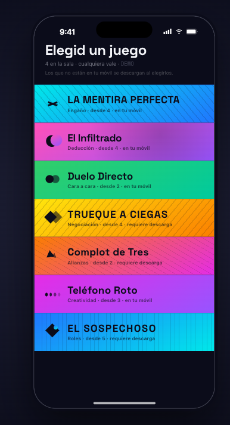
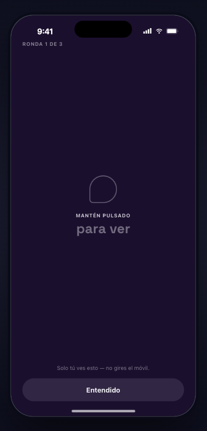
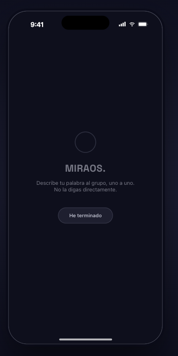
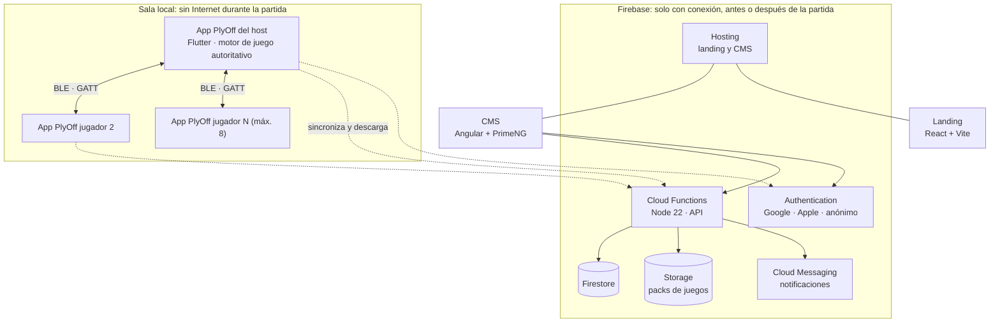
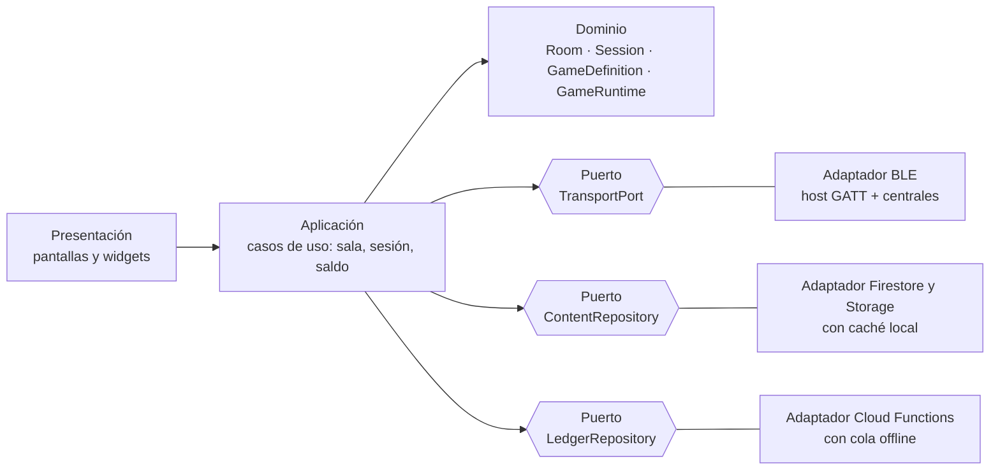
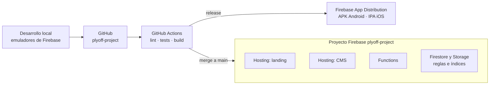
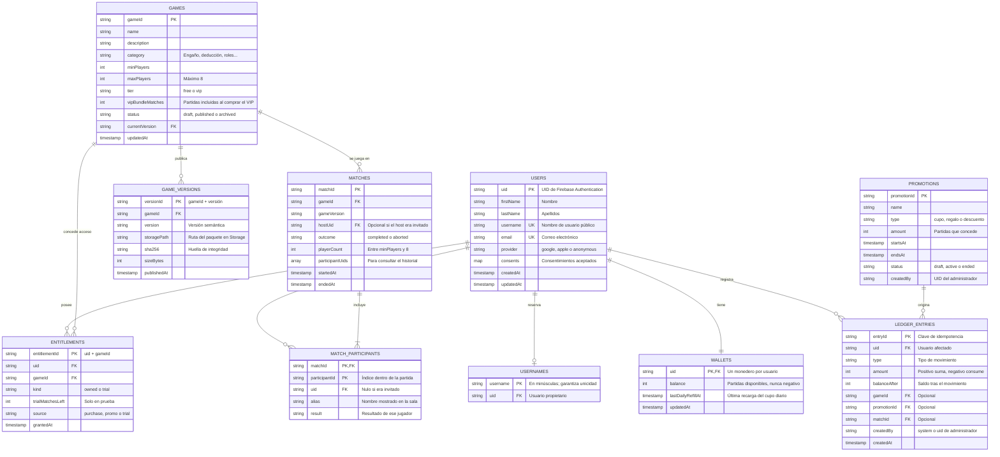

## Índice

0. [Ficha del proyecto](#0-ficha-del-proyecto)
1. [Descripción general del producto](#1-descripción-general-del-producto)
2. [Arquitectura del sistema](#2-arquitectura-del-sistema)
3. [Modelo de datos](#3-modelo-de-datos)
4. [Especificación de la API](#4-especificación-de-la-api)
5. [Historias de usuario](#5-historias-de-usuario)
6. [Tickets de trabajo](#6-tickets-de-trabajo)
7. [Pull requests](#7-pull-requests)

---

## 0. Ficha del proyecto

### **0.1. Tu nombre completo:**

Borja Fernandez Gutierrez

### **0.2. Nombre del proyecto:**

PlyOff

### **0.3. Descripción breve del proyecto:**

PlyOff es una plataforma de juegos sociales presenciales para móvil. Un grupo de personas que están en el mismo lugar juega junta, cada una desde su propio teléfono, conectados entre sí por Bluetooth y sin necesidad de Internet durante la partida. Se puede jugar la primera partida como invitado, sin registro, y después el jugador se registra con un login social para conservar su historial, su saldo y, más adelante, su ranking. Cada móvil muestra información privada (palabras secretas, roles) mientras el grupo interactúa cara a cara, y por eso funciona incluso en un avión o en un sitio sin cobertura. El sistema se completa con una web de presentación, un CMS para administrar juegos, jugadores y saldo de partidas, y una API sobre Firebase.

### **0.4. URL del proyecto:**

- Web de presentación (landing): https://plyoff-project.web.app/
- CMS de administración: https://cms-plyoff-project.web.app/

> Estado en la Entrega 1: los sitios de Firebase Hosting están creados pero todavía no hay nada desplegado. El despliegue se documenta y se completa en las siguientes entregas.

### 0.5. URL o archivo comprimido del repositorio

https://github.com/bfernandez1925/plyoff-project (público). Es un monorepo con la app móvil, la web, el CMS, las Cloud Functions y las especificaciones de producto en `openspec/`.

---

## 1. Descripción general del producto

### **1.1. Objetivo:**

**Qué es.** PlyOff es una plataforma para jugar a juegos de grupo de "información oculta" (deducción, engaño, roles, negociación) usando el móvil de cada persona como su propia mano de cartas privada, en persona y sin depender de Internet.

**Qué problema resuelve.** Los juegos de mesa sociales con información secreta suelen exigir cartas, papel o una app que necesita conexión, cuentas y que alguien lo configure todo. Ninguna de esas opciones funciona bien en un viaje, en un avión, en la playa o en cualquier sitio sin cobertura, y todas añaden fricción antes de empezar a jugar.

**Qué valor aporta.**

- **Presencial primero:** el móvil no sustituye la interacción social, la provoca. Buena parte de cada partida ocurre hablando, mirándose y discutiendo, con el teléfono solo como soporte de lo secreto.
- **Cero fricción para empezar:** la primera partida se juega como invitado, sin registro ni pago. Se crea o se une a una sala y se juega; el registro llega después, cuando el jugador ya ha visto el valor.
- **Offline de verdad:** una vez preparada la partida, funciona sin Internet ni servidor, porque los dispositivos se comunican por Bluetooth.
- **Plataforma, no un solo juego:** un marco común de salas, identidad efímera, votaciones, roles y resultados sobre el que se pueden publicar muchos juegos nuevos desde un CMS.

**Para quién.** Grupos de amigos y familias que se reúnen en persona (desde 4 personas en los juegos iniciales) y quieren jugar algo sencillo, divertido y fácil de compartir, sin preparar nada.

### **1.2. Características y funcionalidades principales:**

**Alcance del MVP (must-have):**

1. **Salas locales por Bluetooth.** Una persona crea la sala y pasa a ser el host; el resto se une con su nombre de perfil o, si es invitado, con un alias asignado por defecto. Se ve quién hay, quién es el host y si la sala está lista para empezar.
2. **Catálogo de juegos con descarga previa.** El host elige juego; los que no están en el móvil se descargan con conexión antes de jugar. La sala solo está lista cuando el juego está preparado para jugar sin Internet.
3. **Juego completo con información privada: El Infiltrado.** Cada jugador ve su palabra secreta con "mantén pulsado para ver"; uno recibe una palabra distinta. El grupo describe su palabra en voz alta sin decirla, y después se vota quién es el infiltrado.
4. **Resultados y revancha.** Al terminar se muestran los resultados y el grupo vuelve a la misma sala para repetir o cambiar de juego, sin volver a unirse.
5. **CMS de administración.** Gestión de juegos y packs de contenido, de jugadores y de saldo de partidas (promociones y regalos).

6. **Registro con login social y zona privada.** Los invitados pueden jugar la primera partida sin registrarse; al ver los resultados se les invita a registrarse (Google o Apple) para guardar su historial de partidas y su saldo. La sesión del invitado se vincula a la cuenta sin perder lo ya ganado, y una vez iniciada sesión la app funciona sin conexión.

**Deseables (should-have):**

- **Tarjeta de resultados compartible** en redes sociales, pensada para difundir la app.
- **Segundo juego, La Mentira Perfecta,** que reutiliza el mismo marco con reglas distintas y demuestra que la plataforma admite múltiples juegos.

**Modelo de monetización (freemium):**

- Cupo diario gratuito de partidas que se recarga solo, para poder jugar casi siempre.
- Packs de partidas de pago y partidas ganadas viendo anuncios con recompensa (siempre opcionales y fuera de la partida).
- Juegos "VIP" de compra única que incluyen un pack de partidas y quedan en propiedad; quien no los tiene puede probarlos con unas partidas gratuitas dentro de la sala de quien sí los tiene.
- Todos los movimientos de saldo se registran como transacciones (compra, recarga, anuncio, promoción, regalo, consumo), lo que permite al CMS auditar y lanzar promociones.
- En el MVP las compras están simuladas; la integración con las tiendas de aplicaciones es trabajo futuro.

**Registro y fidelización.** El registro es incentivado pero no obligatorio: la primera partida es siempre posible como invitado (muro suave tras la primera partida). Así se fideliza sin frenar la viralidad y se respeta la especificación de identidad local, que no permite exigir una cuenta para participar en una partida.

**Visión a futuro (fuera del alcance de este TFM):**

- **Fase 2 (social):** rankings, amigos y contacto entre jugadores, con su correspondiente política de privacidad y consentimiento.
- **Fase posterior:** juegos remotos y streaming con conexión, evolucionando PlyOff hacia una plataforma social de juegos.

**Compromisos de producto** (recogidos en las especificaciones `openspec/`): la partida nunca depende del backend ni de Internet; una cuenta nunca es requisito para jugar la primera partida (la identidad de invitado es efímera); el host tiene una autoridad mínima y definida; si el host se va, la sala termina; y el diseño tiene en cuenta la accesibilidad desde el principio.

### **1.3. Diseño y experiencia de usuario:**

Estos son los diseños iniciales de la experiencia (mockups) que guían la implementación. El recorrido del usuario es: abrir la app, crear o unirse a una sala, elegir juego, jugar y ver resultados.

**1. Selección de juego.** El host ve el catálogo con la categoría de cada juego, el mínimo de jugadores y si ya está en su móvil o requiere descarga.



**2. Información privada.** Cada jugador mantiene pulsado para ver su palabra. Solo él la ve, y se le recuerda que no gire el móvil.



**3. Fase social.** La pantalla se apaga a lo esencial y el grupo interactúa cara a cara: cada jugador describe su palabra sin decirla y pulsa "He terminado".



> Los mockups son la referencia de diseño de la Entrega 1. Las capturas de la aplicación en funcionamiento se añadirán en las entregas 2 y final.

### **1.4. Instrucciones de instalación:**

> El código se entrega en la Entrega 2. Esta sección documenta el procedimiento previsto para el monorepo y se validará y ajustará al implementarlo.

**Requisitos previos**

- Git
- Node.js 22 y npm
- Flutter (canal estable) y, según la plataforma objetivo, Android Studio (Android) o Xcode (iOS)
- Firebase CLI (`npm install -g firebase-tools`) y Java (necesario para los emuladores)
- Un dispositivo físico Android o iOS: Bluetooth no funciona en los simuladores

**Estructura del monorepo**

```
plyoff-project/
├── app/          Aplicación móvil (Flutter)
├── landing/      Web de presentación (React + Vite)
├── cms/          CMS de administración (Angular + PrimeNG)
├── functions/    API (Firebase Cloud Functions, Node 22)
├── openspec/     Especificaciones de producto (OpenSpec)
└── firebase.json Configuración de Hosting, Firestore, Storage y Functions
```

**Puesta en marcha en local**

```bash
# 1. Clonar el repositorio
git clone https://github.com/bfernandez1925/plyoff-project.git
cd plyoff-project

# 2. Backend y base de datos con los emuladores de Firebase
cd functions && npm install && cd ..
firebase emulators:start        # Functions, Firestore, Auth, Storage y Hosting

# 3. Cargar datos de ejemplo (juegos, packs y saldos de prueba)
npm run seed --prefix functions

# 4. CMS de administración
cd cms && npm install && npm start      # http://localhost:4200

# 5. Web de presentación
cd landing && npm install && npm run dev

# 6. Aplicación móvil (con un dispositivo conectado)
cd app && flutter pub get && flutter run
```

**Configuración.** Las claves y credenciales no se versionan: se copia `.env.example` a `.env` en cada paquete. Para trabajar en local solo se necesitan los emuladores, sin proyecto de Firebase real.

**Verificación.** Con los emuladores en marcha, el CMS debe mostrar el catálogo de juegos cargado por el seed, y la app móvil debe permitir crear una sala y ver el juego elegido en otro dispositivo cercano.

---

## 2. Arquitectura del Sistema

### **2.1. Diagrama de arquitectura:**

PlyOff combina dos mundos que deliberadamente no se mezclan: **la partida**, que ocurre entre móviles cercanos por Bluetooth sin ningún servidor, y **la plataforma**, que vive en Firebase y solo se usa con conexión, antes o después de jugar.



Dentro de la app móvil se sigue una **arquitectura hexagonal (puertos y adaptadores)**, de modo que el motor de juego no conoce ni Bluetooth ni Firebase:



**Patrones y decisiones de arquitectura (ADR resumidos)**

| # | Decisión | Por qué | Sacrificio |
|---|----------|---------|-----------|
| 1 | **Transporte por Bluetooth Low Energy**, con el host como periférico GATT y el resto como centrales, común a Android e iOS | Es lo único que permite jugar sin cobertura (avión, playa) y entre plataformas distintas en la misma sala | Ancho de banda bajo (mensajes pequeños y fragmentados) y pocas conexiones simultáneas: de ahí el máximo de 8 jugadores. El rol de periférico requiere código nativo (canal de plataforma) |
| 2 | **Host autoritativo**: un solo dispositivo mantiene el estado de la partida y los demás son clientes ligeros | Coincide con la especificación de producto, simplifica la consistencia y evita filtrar información privada | Si el host se cae, la partida se interrumpe y la sala termina (decisión explícita de producto: no hay migración de host) |
| 3 | **Transporte tras una interfaz (`TransportPort`)** | Permite cambiar BLE por Wi-Fi local u otro medio sin tocar el motor de juego, y probar el motor con un transporte falso en memoria | Una capa más de abstracción |
| 4 | **Firebase como plataforma** (BaaS serverless) | Un solo proveedor para autenticación, base de datos, ficheros, notificaciones, hosting y API; sin servidores que operar; emuladores locales para desarrollar | Dependencia de un proveedor; Firestore no es relacional; las Cloud Functions requieren el plan Blaze (de pago por uso, con cuota gratuita) |
| 5 | **Saldo de partidas como registro de transacciones (ledger)** en lugar de un contador | Trazabilidad, auditoría desde el CMS, sincronización tras trabajar offline y promociones o regalos sin perder histórico | Más escrituras y más complejidad que un simple número |
| 6 | **Monorepo** con app, landing, CMS, functions y specs | Una sola URL de entrega, una única CI, `openspec/` como fuente de verdad y modelos compartidos | Un repositorio mayor que hay que organizar bien |

**Beneficios principales:** el juego no depende de Internet ni de servidores; el motor es totalmente testeable sin dispositivos reales; añadir un juego nuevo no requiere tocar la plataforma; y el coste operativo inicial es mínimo. **Déficits:** la fiabilidad real de BLE con 8 dispositivos y en ambos sistemas operativos es el mayor riesgo técnico y se validará con una prueba de concepto temprana.

### **2.2. Descripción de componentes principales:**

- **App móvil (Flutter/Dart).** Contiene la interfaz, el motor de juego (`GameRuntime`), la gestión de salas y sesión, y el saldo. Tecnologías previstas: Flutter, Riverpod para el estado, almacenamiento local en SQLite para el catálogo descargado, el saldo y la cola de sincronización offline, `flutter_blue_plus` para el rol de central de BLE y un módulo nativo (Kotlin y Swift) para el rol de periférico GATT del host, y AdMob para los anuncios con recompensa.
- **Motor de juego (`GameRuntime`).** Ejecuta las reglas de un juego durante una sesión a partir de su `GameDefinition` (acciones válidas, estado compartido y privado, condición de fin, política de abandono, resultados). Es independiente del transporte y del contenido concreto de cada juego.
- **API (Firebase Cloud Functions, Node 22, TypeScript).** Funciones HTTPS que exponen el catálogo, consumen partidas del saldo, registran y sincronizan resultados y gestionan promociones. Es la única vía de escritura sobre el saldo.
- **Base de datos (Cloud Firestore).** Usuarios, catálogo de juegos y packs, derechos de acceso, ledger de partidas, historial y promociones. Con persistencia offline en el cliente.
- **Almacenamiento (Cloud Storage).** Paquetes de contenido de cada juego (reglas, palabras, recursos), versionados y con huella de integridad, que la app descarga antes de jugar.
- **Autenticación (Firebase Authentication).** Login social con Google y Apple, y sesión anónima para invitados, que se vincula a la cuenta al registrarse.
- **Notificaciones (Firebase Cloud Messaging).** Promociones, regalos de partidas y avisos.
- **CMS (Angular + PrimeNG).** Panel de administración: alta y edición de juegos y packs, gestión de jugadores, saldos y promociones, con acceso restringido a administradores.
- **Landing (React + Vite).** Web de presentación del producto y enlace a las tiendas.

### **2.3. Descripción de alto nivel del proyecto y estructura de ficheros**

El repositorio es un monorepo con un paquete por componente y las especificaciones de producto en la raíz. Cada paquete sigue la convención de su framework, y la app aplica arquitectura hexagonal por capas.

```
plyoff-project/
├── app/                        Aplicación móvil (Flutter)
│   ├── lib/
│   │   ├── presentation/       Pantallas, widgets y estado (Riverpod)
│   │   ├── application/        Casos de uso: crear sala, iniciar sesión, consumir partida
│   │   ├── domain/             Room, Session, GameDefinition, GameRuntime, Ledger
│   │   ├── ports/              TransportPort, ContentRepository, LedgerRepository
│   │   └── adapters/           ble/, firebase/, local_db/
│   ├── android/  ios/          Código nativo (periférico GATT del host)
│   └── test/  integration_test/
├── functions/                  API (Cloud Functions, Node 22 + TypeScript)
│   ├── src/                    handlers/, services/, repositories/, models/
│   └── test/
├── cms/                        CMS (Angular + PrimeNG)
│   └── src/app/                features/ (games, players, wallet, promos), core/, shared/
├── landing/                    Web de presentación (React + Vite)
├── openspec/                   Especificaciones de producto y cambios archivados
│   ├── specs/                  Fuente de verdad: visión, sala, sesión, identidad, contenido
│   └── changes/                Propuestas y cambios (incluido el historial archivado)
├── docs/                       Diagramas y material de apoyo de la documentación
├── firebase.json               Hosting (landing y CMS), Firestore, Storage y Functions
├── firestore.rules             Reglas de seguridad de Firestore
├── storage.rules               Reglas de seguridad de Storage
└── .github/workflows/          Integración y despliegue continuos
```

La separación de `domain`, `ports` y `adapters` es lo que permite probar el motor de juego con un transporte falso y sustituir tecnologías sin reescribir las reglas de los juegos.

### **2.4. Infraestructura y despliegue**

Todo se despliega en un único proyecto de Firebase (`plyoff-project`), con dos sitios de Hosting: la landing (`plyoff-project.web.app`) y el CMS (`cms-plyoff-project.web.app`). La app móvil se distribuye por separado.



**Proceso de despliegue previsto**

1. En cada pull request, la CI ejecuta el análisis estático, los tests unitarios y de integración, y compila los paquetes.
2. Al fusionar en `main`, se despliegan las reglas y los índices, las Cloud Functions y los dos sitios de Hosting con la CLI de Firebase (`firebase deploy --only hosting:landing,hosting:cms,functions,firestore,storage`).
3. Las versiones de la app móvil se publican como artefactos en Firebase App Distribution, sin necesidad de cuentas de desarrollador de pago para la evaluación.
4. En local se desarrolla contra los emuladores de Firebase, sin tocar el proyecto real.

> Estado en la Entrega 1: el proyecto de Firebase y los dos sitios de Hosting están creados, pero todavía no hay nada desplegado. La CI y el despliegue se construirán a partir de la Entrega 2.

### **2.5. Seguridad**

- **Denegar por defecto.** Las reglas de Firestore y Storage niegan todo lo que no se permita explícitamente. Un jugador solo lee y escribe lo suyo; el catálogo es de lectura pública y solo lo modifica el CMS.
- **El saldo solo lo escribe el servidor.** Los clientes no pueden modificar el ledger ni los saldos: cualquier cambio (compra, anuncio, consumo, promoción) pasa por una Cloud Function que valida la operación y evita saldos negativos.
- **Roles del CMS.** El acceso al CMS y a las funciones de administración se restringe con *custom claims* de Firebase Authentication; las funciones comprueban el rol en cada llamada.
- **Información privada de la partida.** El estado privado de cada jugador (por ejemplo su palabra secreta) solo se envía al dispositivo de ese jugador y nunca se difunde al resto. Por defecto no se revela al terminar la partida, salvo que las reglas del juego lo definan.
- **Comunicación local.** Cada sala usa un identificador de sesión y el host valida que cada acción procede de un participante admitido. Está previsto cifrar los mensajes a nivel de aplicación con una clave de sesión acordada al unirse; su validación es parte de la prueba de concepto de BLE.
- **Integridad del contenido.** Los paquetes de juego descargados incluyen una huella (hash) que la app comprueba antes de marcarlos como preparados para jugar sin conexión.
- **Secretos y configuración.** Ninguna credencial se versiona (`.gitignore` y `.env.example`); las claves del servidor se guardan en Secret Manager y se usa Firebase App Check para que solo la app legítima acceda a los servicios.
- **Privacidad y consentimiento.** Se recoge el mínimo de datos personales, el registro es opcional para la primera partida, y los anuncios y las funciones sociales futuras requerirán consentimiento explícito conforme al RGPD.
- **Validación de entradas.** Las funciones validan y sanean todos los parámetros recibidos antes de operar.

### **2.6. Tests**

La estrategia se apoya en las especificaciones de `openspec/`: cada escenario `WHEN/THEN` de una spec es un caso de test candidato, lo que da trazabilidad entre producto y pruebas.

- **Unitarios (Flutter, `flutter test`).** Motor de juego, reglas de sala y sesión, y ledger. Ejemplos derivados de las specs: una sala no admite participantes nuevos mientras hay una partida activa; si el host abandona antes de empezar, la sala termina; la sala no está lista si no se cumple el mínimo de jugadores del juego; una partida de El Infiltrado asigna la palabra distinta a un único jugador.
- **Unitarios y de integración del backend (Jest con los emuladores de Firebase).** Consumir una partida crea la transacción correspondiente en el ledger y rechaza el consumo si el saldo es insuficiente; un usuario no administrador no puede ejecutar funciones del CMS.
- **Reglas de seguridad (`@firebase/rules-unit-testing`).** Un cliente no puede escribir saldos, y un jugador no puede leer los datos de otro.
- **Integración de la app.** Una partida completa entre varios jugadores simulados usando un `TransportPort` en memoria, sin necesidad de Bluetooth real.
- **Extremo a extremo (E2E).** Al menos un test del flujo principal: crear una sala, unirse, elegir El Infiltrado, jugar una ronda y ver los resultados. Para el CMS, un test de Playwright del alta de un juego y una promoción.
- **Pruebas manuales en dispositivos reales.** La conectividad BLE con varios móviles Android e iOS se valida a mano y se documenta, porque no es automatizable con simuladores.

> Estado en la Entrega 1: los tests se planifican en esta documentación y se implementarán junto al código a partir de la Entrega 2. El objetivo es cubrir el motor de juego y el ledger con tests unitarios completos y contar con un test E2E del flujo principal para la entrega final.

---

## 3. Modelo de Datos

### **3.1. Diagrama del modelo de datos:**

La base de datos es **Cloud Firestore** (NoSQL, orientada a documentos). El diagrama usa notación entidad-relación para mostrar las colecciones y sus referencias por identificador, ya que Firestore no impone claves foráneas: las relaciones se mantienen por convención y se protegen con reglas de seguridad y Cloud Functions.



**Notas de modelado**

- **Subcolecciones.** `wallets`, `ledger_entries` y `entitlements` cuelgan de `users/{uid}`; `game_versions` cuelga de `games/{gameId}`; `match_participants` se guarda incrustado en el documento de `matches` (como lista de mapas) porque siempre se lee junto a la partida.
- **Unicidad.** Firestore no tiene restricciones `UNIQUE`, así que el nombre de usuario se reserva creando un documento en `usernames/{username}` dentro de una transacción; si ya existe, falla.
- **Saldo derivado del ledger.** El saldo (`wallets.balance`) es una lectura rápida del resultado de sumar los movimientos de `ledger_entries`. La fuente de verdad es el ledger, que solo se escribe desde Cloud Functions.
- **Caché local.** La app móvil mantiene en SQLite una copia del catálogo descargado, el saldo y una cola de movimientos pendientes de sincronizar para poder jugar sin conexión.
- **Invitados.** Un invitado tiene un UID anónimo de Firebase y un documento mínimo en `users`; al registrarse, la cuenta se vincula al mismo UID, de modo que conserva su saldo, sus pruebas y su historial.

### **3.2. Descripción de entidades principales:**

**`users`** (documento `users/{uid}`): identidad y perfil del usuario.

| Atributo | Tipo | Descripción | Restricciones |
|---|---|---|---|
| `uid` | string | UID de Firebase Authentication | PK, obligatorio |
| `firstName` | string | Nombre | Obligatorio para cuentas registradas |
| `lastName` | string | Apellidos | Obligatorio para cuentas registradas |
| `username` | string | Nombre de usuario público; en invitados se genera uno por defecto | Único (reserva en `usernames`), 3-20 caracteres, obligatorio |
| `email` | string | Correo del proveedor de login | Único, obligatorio para cuentas registradas, nulo en invitados |
| `provider` | string | Método de acceso: `google`, `apple` o `anonymous` | Obligatorio, valor de la lista |
| `consents` | map | `termsAcceptedAt`, `privacyAcceptedAt`, `adsPersonalization` (bool), `marketing` (bool) y `policyVersion` | Obligatorio; los dos primeros son necesarios para registrarse |
| `createdAt`, `updatedAt` | timestamp | Fechas de creación y última modificación | Obligatorios |

El rol de administrador del CMS **no** se guarda aquí: se gestiona con *custom claims* de Authentication.

**`usernames`** (`usernames/{username}`): reserva de nombres. Atributos: `username` (PK, en minúsculas) y `uid` (FK a `users`). Relación 1 a 0..1 con `users`.

**`wallets`** (`users/{uid}/wallet`): saldo de partidas. Atributos: `balance` (int, ≥ 0), `lastDailyRefillAt` (timestamp) y `updatedAt`. Relación 1 a 1 con `users`. Solo escribe el servidor.

**`ledger_entries`** (`users/{uid}/ledger/{entryId}`): registro inmutable de movimientos de saldo.

| Atributo | Tipo | Descripción | Restricciones |
|---|---|---|---|
| `entryId` | string | Identificador del movimiento; actúa como clave de idempotencia | PK; un mismo `entryId` no se registra dos veces |
| `type` | string | `daily_refill`, `purchase`, `vip_bundle`, `ad_reward`, `promo`, `gift`, `consumption` o `adjustment` | Obligatorio |
| `amount` | int | Partidas que suma (+) o consume (-) | Obligatorio, distinto de 0 |
| `balanceAfter` | int | Saldo resultante | Obligatorio, ≥ 0 |
| `gameId`, `promotionId`, `matchId` | string | Referencias opcionales al origen del movimiento | FK opcionales |
| `createdBy` | string | `system` o UID del administrador que lo originó | Obligatorio |
| `createdAt` | timestamp | Fecha del movimiento | Obligatorio |

**`games`** (`games/{gameId}`): catálogo de juegos que gestiona el CMS.

| Atributo | Tipo | Descripción | Restricciones |
|---|---|---|---|
| `gameId` | string | Identificador estable del juego | PK |
| `name`, `description`, `category` | string | Datos de presentación en el selector | Obligatorios |
| `minPlayers`, `maxPlayers` | int | Requisitos de participantes que declara el juego | `2 ≤ minPlayers ≤ maxPlayers ≤ 8` |
| `tier` | string | `free` o `vip` | Obligatorio |
| `vipBundleMatches` | int | Partidas que incluye la compra del VIP | ≥ 0, solo si `tier = vip` |
| `status` | string | `draft`, `published` o `archived` | Obligatorio; solo `published` aparece en el catálogo |
| `currentVersion` | string | Versión vigente del contenido | FK a `game_versions` |

**`game_versions`** (`games/{gameId}/versions/{version}`): cada versión descargable del contenido. Atributos: `version` (semántica), `storagePath` (ruta del paquete en Storage), `sha256` (huella para verificar la integridad), `sizeBytes` y `publishedAt`. Relación N a 1 con `games`.

**`entitlements`** (`users/{uid}/entitlements/{gameId}`): derechos de acceso a juegos VIP. Atributos: `kind` (`owned` o `trial`), `trialMatchesLeft` (int, ≥ 0, solo en prueba), `source` (`purchase`, `promo` o `trial`) y `grantedAt`. Un usuario tiene como máximo un derecho por juego (el `gameId` es el identificador del documento).

**`promotions`** (`promotions/{promotionId}`): campañas gestionadas desde el CMS. Atributos: `name`, `type`, `amount` (partidas que concede), `startsAt`, `endsAt` (posterior a `startsAt`), `status` y `createdBy`. Relación 1 a N con `ledger_entries`.

**`matches`** (`matches/{matchId}`): historial de partidas, sincronizado después de jugar. Atributos: `gameId` y `gameVersion`, `hostUid` (opcional), `outcome` (`completed` o `aborted`), `playerCount` (entre `minPlayers` y 8), `participantUids` (lista de UID registrados para consultar el historial de cada jugador), `participants` (lista de mapas con `alias`, `uid` opcional y `result`), `startedAt` y `endedAt`. La partida se identifica con un `matchId` generado por el host, que también sirve de clave de idempotencia.

**Índices previstos:** `matches` por `participantUids` (array-contains) y `endedAt` descendente; `ledger_entries` por `createdAt` descendente; `games` por `status` y `category`.

---

## 4. Especificación de la API

La API se expone como funciones HTTPS de Firebase (Node 22 y TypeScript) bajo `https://europe-west1-plyoff-project.cloudfunctions.net/api`. Todas las peticiones llevan un token de Firebase Authentication en `Authorization: Bearer <idToken>` (sirve también para invitados, con sesión anónima). Se usan solo con conexión, antes o después de la partida. A continuación se documentan los tres endpoints principales.

```yaml
openapi: 3.0.3
info:
  title: PlyOff API
  version: 1.0.0
  description: API de plataforma de PlyOff. Nunca se invoca durante una partida.
servers:
  - url: https://europe-west1-plyoff-project.cloudfunctions.net/api
security:
  - firebaseAuth: []
paths:
  /v1/catalog:
    get:
      summary: Catálogo de juegos publicados
      description: Devuelve los juegos publicados con su versión vigente y los datos para descargar el paquete, además de los derechos del usuario sobre cada juego.
      responses:
        "200":
          description: Catálogo
          content:
            application/json:
              schema:
                type: object
                properties:
                  games:
                    type: array
                    items:
                      $ref: "#/components/schemas/CatalogGame"
              example:
                games:
                  - gameId: el-infiltrado
                    name: El Infiltrado
                    category: Deducción
                    minPlayers: 4
                    maxPlayers: 8
                    tier: free
                    version: 1.0.0
                    package:
                      downloadUrl: https://firebasestorage.googleapis.com/...
                      sha256: 9f2c7e...
                      sizeBytes: 48213
                    access: { kind: owned }
        "401":
          $ref: "#/components/responses/Unauthorized"
  /v1/wallet/consume:
    post:
      summary: Consumir una partida del saldo
      description: Registra en el ledger el consumo de una partida. Es idempotente por matchId, de modo que la app puede reenviarlo sin riesgo al recuperar la conexión (por ejemplo tras jugar en un avión).
      requestBody:
        required: true
        content:
          application/json:
            schema:
              type: object
              required: [matchId, gameId]
              properties:
                matchId: { type: string, description: Identificador de la partida, generado por el host }
                gameId: { type: string }
            example:
              matchId: 7c1f0d2e-3b9a-4f5e-8a61-2d9e4c0b1a77
              gameId: el-infiltrado
      responses:
        "201":
          description: Partida consumida
          content:
            application/json:
              example: { entryId: 7c1f0d2e-3b9a-4f5e-8a61-2d9e4c0b1a77, balance: 4 }
        "200":
          description: La partida ya estaba registrada (repetición idempotente)
        "402":
          description: Saldo insuficiente
          content:
            application/json:
              example: { error: INSUFFICIENT_BALANCE, message: No te quedan partidas disponibles }
        "401":
          $ref: "#/components/responses/Unauthorized"
  /v1/matches:
    post:
      summary: Registrar el resultado de una partida
      description: Guarda en el historial una partida terminada, jugada sin conexión. Es idempotente por matchId.
      requestBody:
        required: true
        content:
          application/json:
            schema:
              $ref: "#/components/schemas/MatchResult"
            example:
              matchId: 7c1f0d2e-3b9a-4f5e-8a61-2d9e4c0b1a77
              gameId: el-infiltrado
              gameVersion: 1.0.0
              outcome: completed
              startedAt: "2026-09-25T10:15:00Z"
              endedAt: "2026-09-25T10:21:30Z"
              participants:
                - { uid: uid-borja, alias: Borja, result: winner }
                - { alias: Invitado 3, result: loser }
      responses:
        "201":
          description: Partida registrada
        "200":
          description: La partida ya estaba registrada (repetición idempotente)
        "400":
          description: Datos inválidos (por ejemplo, más de 8 participantes)
        "401":
          $ref: "#/components/responses/Unauthorized"
components:
  securitySchemes:
    firebaseAuth:
      type: http
      scheme: bearer
      bearerFormat: Firebase ID token
  responses:
    Unauthorized:
      description: Token ausente o no válido
  schemas:
    CatalogGame:
      type: object
      properties:
        gameId: { type: string }
        name: { type: string }
        category: { type: string }
        minPlayers: { type: integer }
        maxPlayers: { type: integer, maximum: 8 }
        tier: { type: string, enum: [free, vip] }
        version: { type: string }
        package:
          type: object
          properties:
            downloadUrl: { type: string }
            sha256: { type: string }
            sizeBytes: { type: integer }
        access:
          type: object
          properties:
            kind: { type: string, enum: [owned, trial, none] }
            trialMatchesLeft: { type: integer }
    MatchResult:
      type: object
      required: [matchId, gameId, gameVersion, outcome, startedAt, endedAt, participants]
      properties:
        matchId: { type: string }
        gameId: { type: string }
        gameVersion: { type: string }
        outcome: { type: string, enum: [completed, aborted] }
        startedAt: { type: string, format: date-time }
        endedAt: { type: string, format: date-time }
        participants:
          type: array
          maxItems: 8
          items:
            type: object
            required: [alias]
            properties:
              uid: { type: string, description: Ausente si el participante era invitado }
              alias: { type: string }
              result: { type: string }
```

> El CMS usa funciones de administración adicionales (alta de juegos, promociones, regalo de partidas) restringidas al rol de administrador; se documentarán con el código en las siguientes entregas.

---

## 5. Historias de Usuario

Las historias están ordenadas según el orden previsto de desarrollo: primero el catálogo, después las salas y por último el juego. Cada historia se descompone en tickets técnicos (sección 6) y se traza a las especificaciones de `openspec/`.

**Historia de Usuario 1: Ver el catálogo y saber qué puedo jugar sin conexión**

- **Como** host de un grupo,
- **quiero** ver el catálogo de juegos indicando cuáles ya están en mi móvil y cuáles requieren descarga,
- **para** elegir uno que mi grupo pueda jugar aunque no tengamos cobertura.

*Prioridad:* must-have · *Estimación:* 5 puntos · *Trazabilidad:* `game-content-framework`, `local-room` (readiness), `core-user-journey` (selección de juego).

*Criterios de aceptación:*

1. **Dado** que tengo conexión, **cuando** abro el selector de juegos, **entonces** veo cada juego publicado con su nombre, categoría, mínimo de jugadores y una marca clara de "en tu móvil" o "requiere descarga" (que no dependa solo del color).
2. **Dado** un juego que requiere descarga, **cuando** lo elijo, **entonces** la app lo descarga, comprueba su huella (SHA-256) y solo entonces lo marca como preparado para jugar sin conexión.
3. **Dado** que estoy sin conexión, **cuando** abro el selector, **entonces** veo los juegos ya descargados y los demás aparecen no disponibles con un motivo comprensible, sin mostrarse como un error técnico.
4. **Dado** un juego con paquete dañado (la huella no coincide), **cuando** termina la descarga, **entonces** no se marca como preparado y se ofrece reintentar.

**Historia de Usuario 2: Unirme a una sala cercana sin registrarme**

- **Como** jugador invitado,
- **quiero** encontrar la sala de mis amigos por Bluetooth y unirme con un alias por defecto,
- **para** entrar en la partida en pocos segundos, sin cuenta y sin Internet.

*Prioridad:* must-have · *Estimación:* 8 puntos · *Trazabilidad:* `local-room`, `local-session-identity`, `core-user-journey`.

*Criterios de aceptación:*

1. **Dado** que hay una sala cercana, **cuando** abro la app, **entonces** veo el nombre del host, el juego elegido (o que no hay ninguno), el número de participantes y si la sala admite nuevos jugadores, sin haber tenido que introducir ningún dato.
2. **Dado** que me uno, **cuando** no escribo ningún nombre, **entonces** se me asigna un alias por defecto y se me distingue de otros participantes aunque compartamos alias.
3. **Dado** que la sala tiene una partida en marcha, **cuando** intento unirme, **entonces** recibo un motivo comprensible ("la partida ya ha empezado") y puedo intentarlo cuando la sala vuelva a estar reunida.
4. **Dado** que hay 8 participantes, **cuando** un noveno intenta unirse, **entonces** se le rechaza con el motivo "sala llena".
5. **Dado** que estoy en modo avión con Bluetooth activado, **cuando** creo o me uno a una sala, **entonces** todo funciona igual que con conexión.

**Historia de Usuario 3: Jugar una ronda de El Infiltrado**

- **Como** jugador,
- **quiero** ver mi palabra secreta solo yo, describirla al grupo sin decirla y votar quién creo que es el infiltrado,
- **para** resolver la ronda y saber quién ha ganado.

*Prioridad:* must-have · *Estimación:* 13 puntos · *Trazabilidad:* `local-game-session`, `game-content-framework`, `core-user-journey` (información privada).

*Criterios de aceptación:*

1. **Dado** que el host inicia la partida con entre 4 y 8 jugadores, **cuando** empieza la ronda, **entonces** todos los jugadores menos uno reciben la misma palabra y un único jugador recibe una palabra distinta, sin que nadie sepa quién es.
2. **Dado** que veo la pantalla de mi palabra, **cuando** mantengo pulsado, **entonces** veo mi palabra solo mientras mantengo el dedo, y se me avisa de que no gire el móvil; **cuando** suelto, la palabra se oculta.
3. **Dado** que todos han pulsado "Entendido", **cuando** empieza la fase social, **entonces** la pantalla muestra solo la instrucción de describir la palabra al grupo, y cada jugador marca "He terminado" al acabar.
4. **Dado** que termina la fase social, **cuando** todos votan, **entonces** se cuentan los votos y se revela quién era el infiltrado y si el grupo acertó.
5. **Dado** que termina la ronda, **cuando** se muestran los resultados, **entonces** el grupo vuelve a la misma sala para repetir o cambiar de juego, sin volver a unirse.
6. **Dado** que un jugador sale durante la partida, **cuando** ocurre, **entonces** el resto entiende qué ha pasado y si la partida continúa o se aborta.

**Backlog restante del MVP** (historias ya identificadas que se desarrollarán después): registro con login social y muro suave tras la primera partida; consumo de partidas y saldo con cupo diario; publicación de juegos y promociones desde el CMS; tarjeta de resultados compartible (should-have); segundo juego, La Mentira Perfecta (should-have).

---

## 6. Tickets de Trabajo

Los tres tickets forman una **rebanada vertical** del producto, ordenada como se va a construir: primero los datos (T1), después la API que los expone (T2) y por último la pantalla que los muestra (T3). Los tres derivan de la Historia de Usuario 1.

### **Ticket 1 (Base de datos): Reglas de seguridad, índices y datos de ejemplo de Firestore**

- **Identificador:** PLY-1 · **Historia:** HU-1 · **Estimación:** 3 puntos (unas 4 horas) · **Dependencias:** ninguna (es el primer ticket).
- **Descripción.** Definir la seguridad y la estructura consultable de Firestore según el modelo de datos de la sección 3, y crear un script que cargue datos de ejemplo para poder desarrollar y probar en local sin depender de datos reales.
- **Tareas.**
  1. Crear `firestore.rules` con denegación por defecto y estas reglas: el catálogo (`games` publicados y sus versiones) es de lectura pública; `users/{uid}` y sus subcolecciones solo las lee su propietario; `wallet`, `ledger` y `entitlements` son de solo lectura para el cliente (solo escriben las Cloud Functions); `games` y `promotions` solo las modifica un usuario con el *claim* de administrador; `matches` la lee quien figure en `participantUids` y no la escribe el cliente.
  2. Crear `storage.rules`: los paquetes de contenido son de lectura autenticada y solo escriben los administradores.
  3. Crear `firestore.indexes.json` con los índices compuestos de la sección 3.2 (`matches` por `participantUids` y `endedAt`; `ledger` por `createdAt`; `games` por `status` y `category`).
  4. Crear `functions/scripts/seed.ts`, ejecutable con `npm run seed`, que use el SDK de administración contra los emuladores y cargue: dos juegos (El Infiltrado, gratuito, y La Mentira Perfecta, VIP), sus versiones con el paquete subido al emulador de Storage y su huella SHA-256 calculada, una promoción activa y un usuario de prueba con saldo de 5 partidas. El script debe negarse a ejecutarse contra el proyecto real salvo que se pase una marca explícita.
  5. Escribir tests de reglas con `@firebase/rules-unit-testing`.
- **Criterios de aceptación.**
  - Un cliente autenticado no puede escribir en `wallet` ni en `ledger`; el test falla si se permite.
  - Un usuario no administrador no puede crear ni modificar juegos ni promociones.
  - Un usuario no puede leer los documentos de otro usuario.
  - `npm run seed` con los emuladores levantados deja el catálogo consultable y es idempotente (ejecutarlo dos veces no duplica datos).
  - `firebase emulators:start` carga reglas e índices sin errores.
- **Definición de hecho.** Reglas y script en el repositorio, tests de reglas en verde y documentado en el README cómo cargar los datos de ejemplo.

### **Ticket 2 (Backend): Endpoint `GET /v1/catalog`**

- **Identificador:** PLY-2 · **Historia:** HU-1 · **Estimación:** 5 puntos (unas 6 horas) · **Dependencias:** PLY-1.
- **Descripción.** Implementar la Cloud Function que devuelve el catálogo de juegos publicados con los datos necesarios para descargarlos y el derecho de acceso del usuario a cada uno, según el contrato de la sección 4.
- **Tareas.**
  1. Crear el manejador en `functions/src/handlers/catalog.ts` (Node 22, TypeScript, región `europe-west1`) y registrarlo bajo `/v1/catalog`.
  2. Añadir un *middleware* que verifique el token de Firebase Authentication (también de sesiones anónimas) y responda 401 si falta o no es válido.
  3. Consultar los juegos con `status == published`, obtener su versión vigente y generar una URL de descarga firmada de corta duración (15 minutos) para el paquete de Storage.
  4. Calcular el campo `access` de cada juego: `owned` si es gratuito o el usuario lo posee, `trial` con las partidas de prueba restantes, o `none`.
  5. Validar la forma de la respuesta y añadir cabeceras de caché adecuadas.
  6. Escribir tests unitarios y de integración con los emuladores.
- **Criterios de aceptación.**
  - Sin token responde 401; con token válido responde 200 con el formato de la sección 4.
  - Solo aparecen juegos publicados; los borradores y archivados nunca se devuelven.
  - `package.sha256` coincide con la huella del fichero real en Storage.
  - Un juego VIP no comprado devuelve `access: none` (o `trial` si le quedan pruebas).
  - El tiempo de respuesta con el catálogo de ejemplo es inferior a 500 ms en emulador.
- **Definición de hecho.** Endpoint con tests en verde, contrato de la sección 4 respetado y probado con los datos del script de PLY-1.

### **Ticket 3 (Frontend): Pantalla de selección de juegos en la app Flutter**

- **Identificador:** PLY-3 · **Historia:** HU-1 · **Estimación:** 5 puntos (unas 6 horas) · **Dependencias:** PLY-2 (se puede empezar con un repositorio simulado).
- **Descripción.** Construir la pantalla "Elegid un juego" según el mockup 1: lista de juegos con su categoría, mínimo de jugadores y estado de descarga, incluyendo el flujo de descarga con verificación y el comportamiento sin conexión.
- **Tareas.**
  1. Definir el puerto `ContentRepository` en `app/lib/ports` y su adaptador HTTP con caché en SQLite en `app/lib/adapters`, más una implementación en memoria para tests.
  2. Crear la pantalla en `app/lib/presentation/game_picker/` con Riverpod, con un color y un icono por categoría y el texto "en tu móvil" o "requiere descarga" (no solo color).
  3. Implementar la descarga con barra de progreso, verificación SHA-256 y marcado como "preparado para jugar sin conexión".
  4. Gestionar los estados de carga, sin conexión (mostrar el catálogo en caché, con los no descargados como no disponibles y un motivo comprensible) y error de descarga con reintento.
  5. Escribir tests de widgets y de lógica con el repositorio en memoria.
- **Criterios de aceptación.**
  - La lista muestra correctamente los datos de un catálogo de ejemplo con juegos gratuitos y VIP.
  - Elegir un juego no descargado inicia la descarga y, al terminar con huella correcta, cambia a "en tu móvil".
  - Una huella incorrecta deja el juego sin marcar y ofrece reintentar.
  - Sin conexión se ven los juegos descargados y no se muestra ningún error técnico.
  - La pantalla es comprensible sin depender del color y compatible con el lector de pantalla.
- **Definición de hecho.** Pantalla funcionando sobre el catálogo del script de PLY-1, tests en verde y captura añadida a la sección 1.3.

---

## 7. Pull Requests

> **Estado en la Entrega 1:** todavía no hay código, por lo que no se han abierto pull requests. Se planifica una PR por ticket, que se documentará aquí con su enlace, descripción y revisión cuando se fusionen (a partir de la Entrega 2).

**Pull Request 1 (prevista):** `feat(db): reglas de seguridad, índices y seed de Firestore`, correspondiente a PLY-1.

**Pull Request 2 (prevista):** `feat(api): endpoint GET /v1/catalog`, correspondiente a PLY-2.

**Pull Request 3 (prevista):** `feat(app): pantalla de selección de juegos con descarga verificada`, correspondiente a PLY-3.
